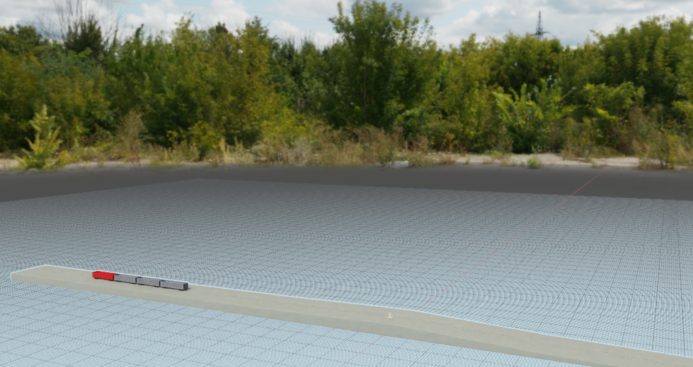
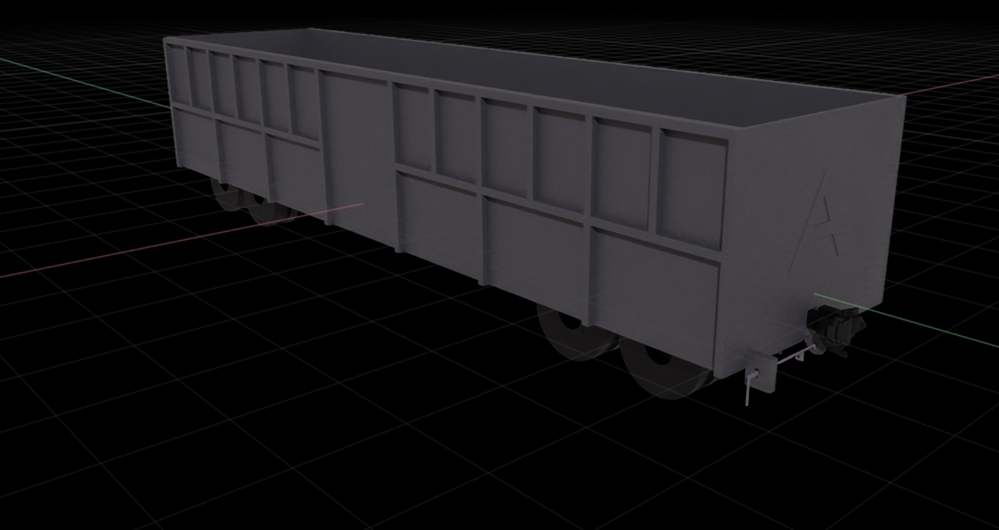
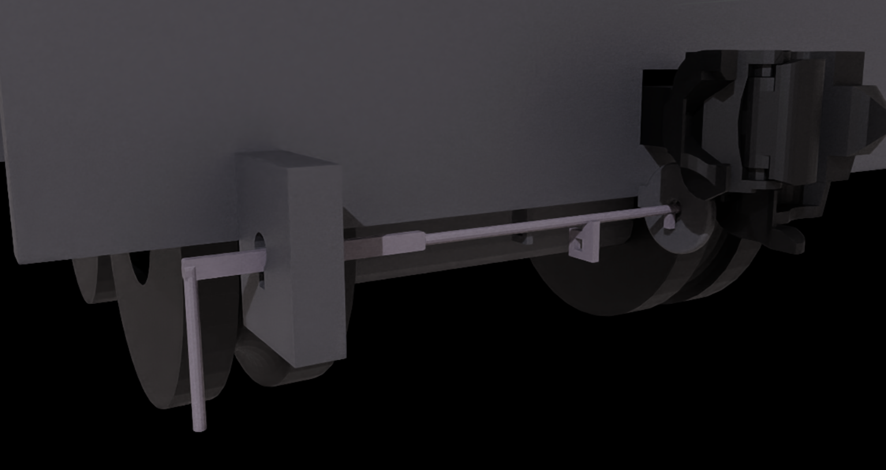
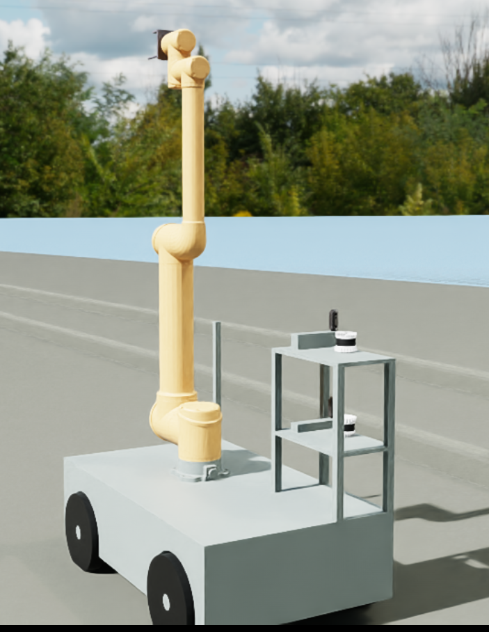
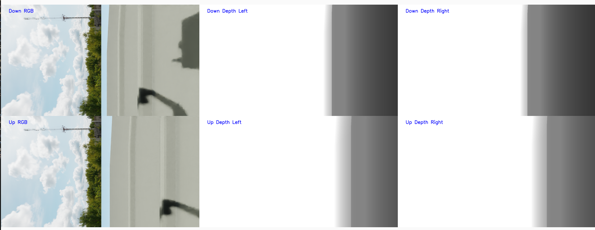

# train_robot项目说明

## 项目介绍

train_robot是一个基于isaacsim的摘钩机器人仿真环境，用于训练机器人完成指定任务。

## 项目进展

- v1.0[2025.05.31] 完成了基本的仿真模型搭建，实现了列车，移动机械臂，驼峰轨道的建模。

- 可获取的信息
    - 2个RGB相机图像，
    - 4个深度图像，
    - 2个3D雷达点云数据，
    - 小车四个车轮的角速度，
    - 机械臂六个关节的角速度，角度，力矩。

- 可控制的部分
    - 列车推车车轮的角速度，
    - 小车四个车轮的角速度，
    - 机械臂六个关节的角速度，角度, 力矩。

## 环境配置
### 系统要求
- 性能较好的独显电脑，显卡要求英伟达RTX4060/3070以上，显存要求8G以上。
- Ubuntu 22.04LTS，建议使用移动硬盘安装双系统，避免ubuntu与windows发生内存共享的冲突，安装前注意备份重要文件。
- nvidia-driver & cuda & cudnn
- conda
- vscode
- VPN(英伟达工具可能需要链接外网)

### 安装步骤
1. 安装上述相关环境及工具
2. 安装isaacsim4.5.0，[参考链接](https://isaac-sim.github.io/IsaacLab/release/2.1.0/source/setup/installation/pip_installation.html)，注意在conda环境中安装4.5.0版本。
3. 安装ROS2桌面版，[参考链接](https://docs.ros.org/en/humble/Installation.html)

### 添加系统变量
打开系统文档
```python
gedit ~/.bashrc
```
在文档末尾添加ros2官方路径，和train_robot环境路径，以及isaacsim对应python.sh路径（重要）
```python
export PATH="/home/[user]/isaacsim:$PATH"
source /opt/ros/humble/setup.bash
source /home/aiden/project/research_group/train_robot/train_robot/ros2_ws/install/setup.bash #添加这一路径之前应该先构建ros2工作区，在ros2_ws目录下执行colcon build
```
注意根据自己电脑上实际的安装路径进行修改

# 安装 对应的库
```python
pip install -r requirements.txt
pip install numpy==1.25.0
```


## 使用说明 
### 启动仿真环境
打开vscode，新建终端，进入train_robot目录，执行命令
```python
conda activate env_isaaclab
./sim.sh
```
### 启动控制脚本
由于ros2建立在系统环境上，这里应该再开一个终端，不使用conda环境，直接使用系统环境（因此系统环境中需要安装yolo相关库，即control.sh中的相关库），执行命令
```python
./control.sh
```

## 注意事项
- 第一次使用isaacsim或者仿真模型时，会进行初始化设置，需等待20-30分钟
- 目前代码中提供了简单的相机和雷达数据可视化，可以直接使用，也可以通过rviz2查看相机和雷达数据，直接终端输入rviz2即可，通过topic添加对应数据
- 由于不同的电脑环境，ros2_ws工作区可能无法直接使用，如果因为环境差异导致无法使用，需要自行构建工作区，添加ros2_ws/src/train_robot/setup.py和ros2_ws/src/train_robot/train_robot/control.py
- 添加小车控制代码，几乎只需要修改control.py中的self.control_cycle函数，根据输入决定输出。
- 几乎所有模型都通过usd文件进行建模，可以通过isaacsim进行查看，方法：启动isaacsim，选择对应usd文件，但是不建议轻易修改usd文件，因为拖动之后，物体的初始位置会发生改变
    ```python
    conda activate env_isaaclab #注意是在安装isaacsim的conda环境中
    isaacsim 
    ```
- 机械臂的三种控制模式，对刚度和阻尼有不同要求，位置控制要求高刚度低阻尼，速度控制要求低刚度高阻尼，力矩控制要求低刚度低阻尼。控制前需要先在usd文件中自行修改6个关节的刚度和阻尼。
- 所有数据的发布频率与仿真频率相同，为60Hz，其中雷达转动频率为10Hz，因此雷达点云数据每次只包含60°的范围

## 效果图
### 场景

### 列车

### 车钩

### 机械臂

### 相机数据


## 使用帮助
- 通过isaacsim查看usd文件，并修改刚度和阻尼
    ```python
    conda activate env_isaaclab
    isaacsim
    # 然后选择usd文件，进行查看和修改
    ```
- 通过修改以下文件，可以设置列车及移动机械臂的速度
    ```python
    train_robot/core/start_stage.py
    train_robot/ros2_ws/src/train_robot/train_robot/control.py
    ```

